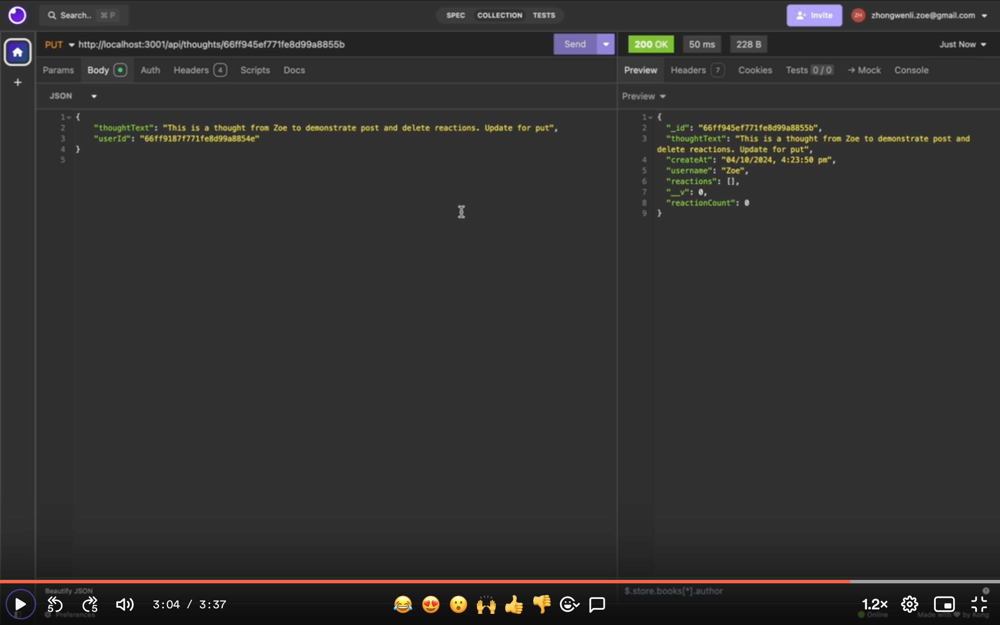

# Social Network API (Module 18 Challenge)

## Description
API for a social network web application that users can share their thoughts, react to friends’ thoughts, and create a friend list.

## Walkthrough Video Link
https://www.loom.com/share/f18b25a7e5a34d2d812bba5a6301dce1

### Summary for Walkthrough Video
After run: npm i, npm run seed and npm run start on VScode, all the routes can be tested on Insomnia. I create the user Amy for testing the get, put and delete routes for a single user. And then create user Zoe and Nate for later demonstration.  By using user Zoe to demonstrate add friend Nate and delete Nate from Zoe's friends list. Then as user Zoe I create 2 thoughts, one for demonstrating get, put and delete a single thought, another one for demonstrating post and delete reactions from user Nate.

### Screenshots of Each Route's Demostration
#### get-all-users

#### create-user-amy

#### get-user-amy

#### update-user-amy

#### delete-user-amy

#### add-friend

#### delete-friend

#### get-all-thoughts

#### create-thought

#### ger-a-single-thought

#### update-a-thought

#### delete-a-thought

#### create-a-reaction

#### delete-a-reaction

